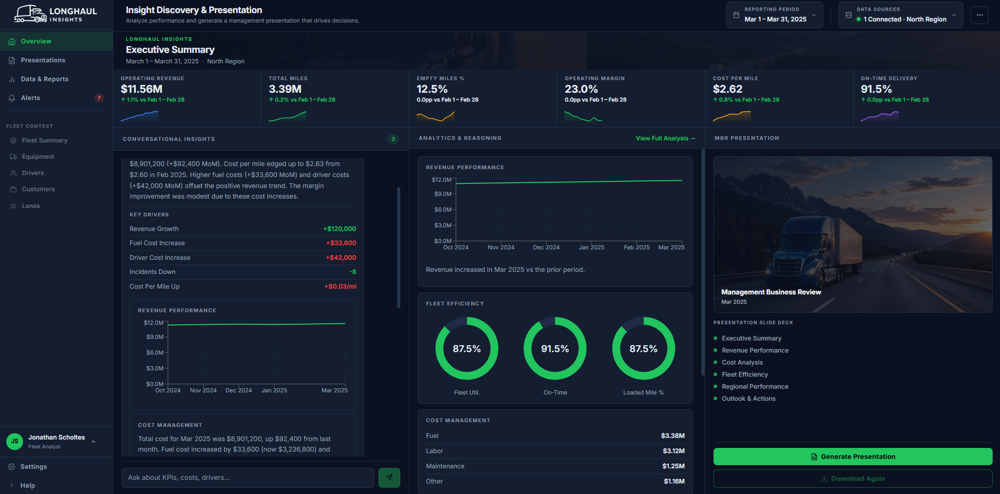
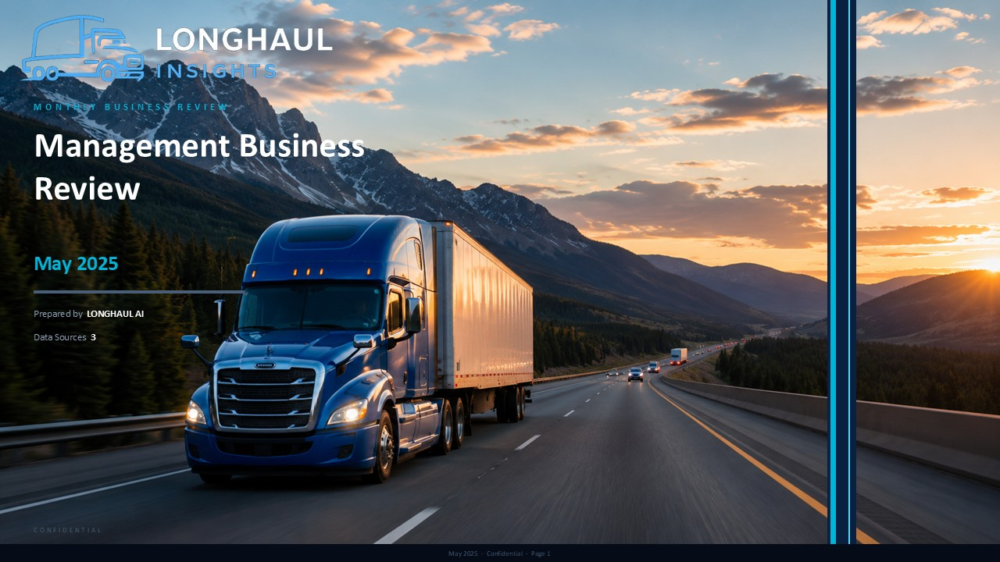
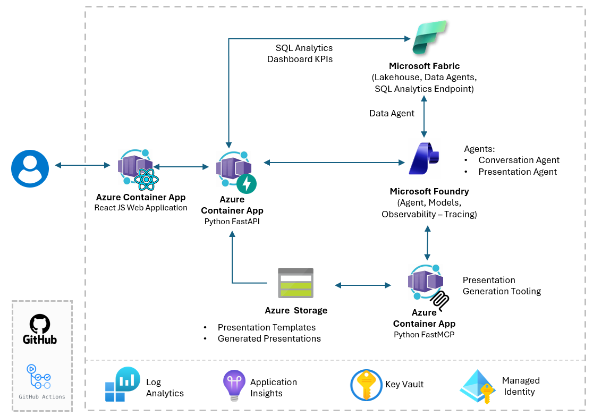
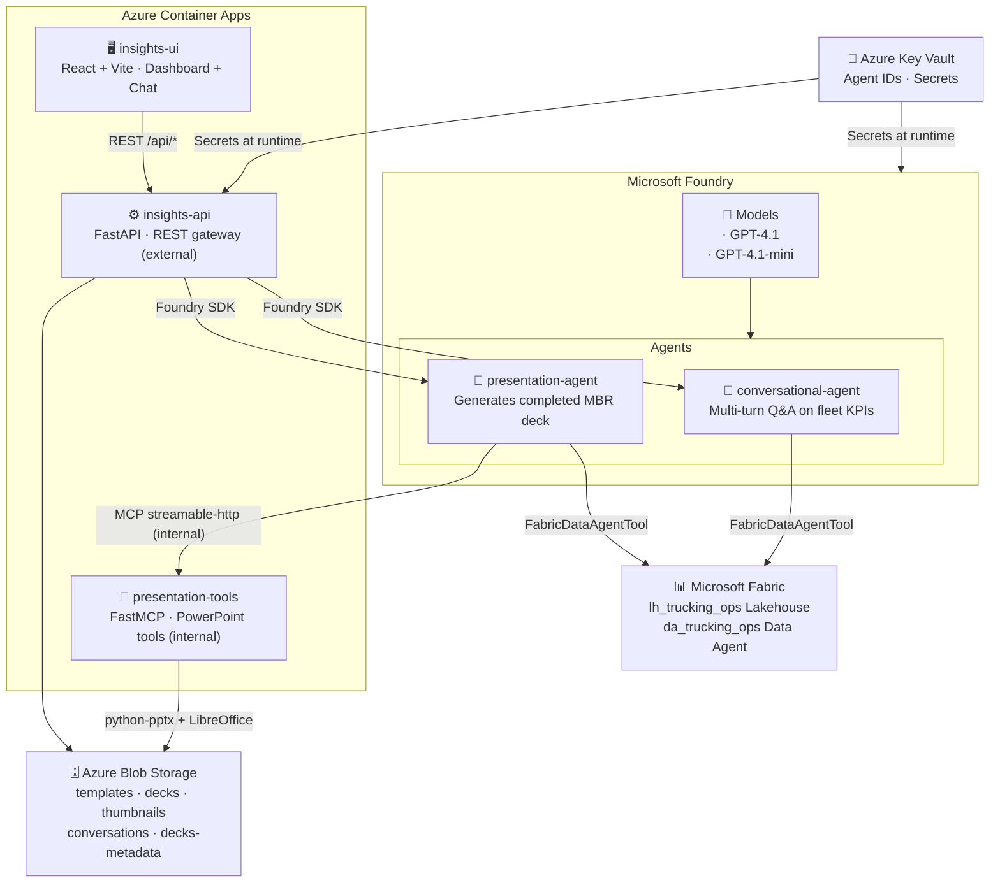

# Insight & Presentation Agents for Operational Data with Microsoft Fabric and Foundry
### End-to-End Example: Natural-Language Insight Discovery and Presentation Generation

> [!WARNING]
> This project is currently in active development and may contain breaking changes. Updates and modifications are being made frequently, which may impact stability or functionality. This notice will be removed once the project reaches a stable release.

This project demonstrates how to connect **Microsoft Fabric structured data** to **Microsoft Foundry agents** — enabling natural-language conversations over live operational data and automated, template-consistent PowerPoint generation via MCP tooling.

> Fabric Lakehouse → **Conversational Agent** surfaces insights through natural language → **Presentation Agent** generates a PowerPoint deck via MCP

---

## Contents

- [Start Here](#start-here)
- [Patterns This Project Demonstrates](#patterns-this-project-demonstrates)
- [Architecture](#architecture)
- [Project Structure](#project-structure)
- [Deployment](#deployment)
- [Configuration](#configuration)
- [Clean Up](#clean-up)

---



*Example scenario: the LONGHAUL operational dashboard. Left — conversational agent answering a question about operating margin. Centre — KPI summary and analytics charts. Right — on-demand presentation generation.*

<table>
  <tr>
    <td width="240" valign="middle">
      <a href="samples/LONGHAUL-MBR-South-May2025.pptx"></a>
    </td>
    <td valign="middle">
      <b>Example output</b><br>
      A LONGHAUL Monthly Business Review for the South region, May 2025; generated end-to-end by the Presentation Agent.<br><br>
      <a href="samples/LONGHAUL-MBR-South-May2025.pptx">⬇ Download the deck (.pptx)</a>
    </td>
  </tr>
</table>

---

## Start Here

If you're exploring:

- How to connect **Microsoft Fabric Lakehouse** data to **Microsoft Foundry agents** without writing SQL in prompts
- How to use the **Fabric Data Agent** as a natural-language interface to structured operational data
- How to orchestrate **multi-turn conversational agents** that reason over live data
- How to drive **template-consistent PowerPoint generation** from agent output via MCP tooling
- How to build a **full-stack AI platform** on Azure Container Apps with managed identity

→ this project provides a complete, working reference implementation of all three patterns.

> **The scenario is an example, not the product.** The example uses **LONGHAUL** — a fictional long-haul trucking company with 13 months of operational KPI data across 5 regions and 20 vehicle types. The domain is interchangeable; the patterns are what matter.


---

## Patterns This Project Demonstrates

### Pattern 1 — Fabric Data Agent as an AI data interface

Rather than writing SQL in agent prompts or hardcoding queries, this project uses the **Fabric Data Agent** as a dedicated natural-language interface to the Lakehouse. Foundry agents call it like a tool — asking questions in plain English and receiving structured answers drawn directly from live data. The agent needs no SQL knowledge; Fabric handles the translation.

### Pattern 2 — Orchestrated agent reasoning over live operational data

The **Conversational Agent** maintains multi-turn threads, allowing users to explore trends, compare dimensions, and drill into drivers — all grounded in live Fabric data rather than static context or pre-computed summaries. Foundry manages thread state and tool routing.

### Pattern 3 — MCP-driven presentation generation

The **Presentation Agent** orchestrates a two-step workflow: retrieve KPIs from the Fabric Data Agent, then invoke an MCP tool (`fill_presentation_template`) that fills a PowerPoint template with `python-pptx`, uploads the completed deck to Azure Blob Storage, and returns a download URL. The agent drives the entire flow; the MCP tool enforces template consistency — every generated deck follows the same structure.

### Adapt this to your domain

The LONGHAUL trucking scenario is a worked example. The same three patterns apply to any domain with structured operational data and a recurring reporting need:

- **Retail** → sales performance, inventory KPIs, regional breakdown
- **Healthcare** → operational metrics, patient outcomes, cost-per-procedure
- **Financial services** → portfolio performance, risk metrics, client reporting
- **Manufacturing** → production efficiency, downtime analysis, quality metrics

To adapt: replace the Fabric Lakehouse tables with your domain data, update the Fabric Data Agent and Foundry agent system prompts, and swap in your PowerPoint template.

---

## Architecture





### Core Components

| Component | Technology | Role |
|---|---|---|
| **conversational-agent** | Microsoft Foundry Agent | Multi-turn Q&A against Fabric KPI data |
| **presentation-agent** | Microsoft Foundry Agent | Orchestrates KPI retrieval and deck generation |
| **da_trucking_ops** | Fabric Data Agent | Natural-language interface to the Lakehouse |
| **lh_trucking_ops** | Microsoft Fabric Lakehouse | 13 months of trucking operational KPI data |
| **insights-api** | FastAPI, Python | REST gateway — routes UI requests to agents and Storage |
| **presentation-tools** | FastMCP, Python | MCP server — PowerPoint template filling, deck management |
| **insights-ui** | React, Vite | Dashboard, KPI bar, conversational chat, MBR library |

---

## Project Structure

<details>
<summary>Expand to view repository layout</summary>

```
Fabric-Foundry-Insight-Presentation-Agents/
├── deploy.ps1                          # Full end-to-end deployment orchestrator
├── README.md                           # This file
│
├── agents/                             # Foundry agent definitions + deployer
│   ├── deploy.py                       # Creates / updates both agents, writes IDs to agents/agent_ids.json
│   ├── conversational_agent.py         # Conversational agent definition
│   └── presentation_agent.py      # MBR presentation agent definition
│
├── apps/
│   ├── insights-api/                        # FastAPI REST gateway (external ACA)
│   │   └── src/
│   │       ├── main.py                 # App entry point, router registration
│   │       ├── config.py              # Environment / settings
│   │       ├── fabric.py              # Fabric SQL connection + KPI queries
│   │       ├── models.py              # Pydantic request/response models
│   │       └── routes/                # kpis, analytics, presentations, templates, conversations
│   │
│   ├── presentation-tools/                  # FastMCP server (internal ACA — agents only)
│   │   └── src/
│   │       └── tools/
│   │           └── powerpoint_tools.py # fill_presentation_template, get_deck_url, get_template_slides
│   │
│   └── insights-ui/                         # React + Vite SPA
│       └── src/
│           ├── App.jsx                 # Period/region state, routing
│           ├── components/             # KpiSummaryBar, PresentationPanel, AnalyticsPanel, ConversationPanel
│           ├── hooks/                  # useKpis, useAnalytics, usePresentationGeneration, useConversation
│           └── pages/                  # Dashboard, PresentationsLibrary, Conversations
│
├── infra/                              # Infrastructure as Code (Terraform)
│   ├── main.tf                         # Root module
│   ├── variables.tf
│   ├── outputs.tf
│   ├── terraform.tfvars.tpl            # Template — filled by deploy.ps1
│   └── modules/
│       ├── ai_services/                # Foundry account + project + GPT-4.1 deployments
│       ├── container_apps/             # insights-api, presentation-tools, insights-ui Container Apps
│       ├── container_registry/         # Azure Container Registry
│       ├── identity/                   # User-assigned managed identity + RBAC
│       ├── key_vault/                  # Key Vault + secrets
│       ├── monitoring/                 # Log Analytics + Application Insights
│       └── storage/                    # Blob Storage (templates, decks, thumbnails, conversations)
│
├── scripts/
│   ├── Deploy-Infrastructure.ps1       # Phase 1: Terraform apply
│   ├── Deploy-Containers.ps1           # Phase 2: ACR image build & push
│   ├── Deploy-FabricWorkspace.ps1      # Phase 3: Create Lakehouse, discover SQL endpoint
│   ├── Deploy-FabricLakehouse.ps1      # Phase 3: Create tables, seed data, upload template
│   ├── Deploy-FabricDataAgent.ps1      # Phase 3b: Create da_trucking_ops + workspace RBAC
│   ├── Deploy-FoundryAgents.ps1        # Phase 4: Deploy Foundry agents
│   ├── New-GitHubOidc.ps1             # GitHub Actions OIDC setup
│   └── common/
│       └── DeploymentFunctions.psm1    # Shared PowerShell utilities
│
├── data/
│   └── templates/                      # mbr_template.pptx — PowerPoint template
│
└── docs/
    └── fabric-setup.md                 # Fabric workspace, Lakehouse, and Data Agent setup guide
```

</details>

---

## Deployment

A Fabric workspace and Lakehouse must exist before running the deploy script — the deployment scripts create all other resources automatically.

```powershell
az login
az account set --subscription "YOUR-SUBSCRIPTION-NAME-OR-ID"

.\deploy.ps1 `
    -Subscription      "YOUR-SUBSCRIPTION-NAME-OR-ID" `
    -FabricWorkspaceId "<workspace-guid>"
```

`deploy.ps1` runs six phases automatically — infrastructure, containers, Lakehouse seeding, Fabric Data Agent creation, and Foundry agent deployment (~20–30 min). Two manual steps in the Fabric portal are required after the script completes.

→ **See [docs/deployment_steps.md](docs/deployment_steps.md) for the full walkthrough**: prerequisites, Fabric workspace setup, all deploy phases, post-deployment portal steps, validation checklist, GitHub Actions, and teardown.

---

## Configuration

<details>
<summary>Expand to view environment variable reference</summary>

### insights-api

| Variable | Source | Description |
|---|---|---|
| `AZURE_CLIENT_ID` | Managed Identity | Client ID of the user-assigned managed identity |
| `FOUNDRY_PROJECT_ENDPOINT` | Terraform output | Foundry project endpoint URL |
| `CONVERSATIONAL_AGENT_NAME` | Container App env var | Agent name set on `ca-insights-api` by `Deploy-FoundryAgents.ps1` |
| `PRESENTATION_AGENT_NAME` | Container App env var | Agent name set on `ca-insights-api` by `Deploy-FoundryAgents.ps1` |
| `FABRIC_SQL_SERVER` | Terraform variable | Fabric SQL analytics endpoint hostname |
| `FABRIC_SQL_DATABASE` | Terraform variable | `lh_trucking_ops` |
| `STORAGE_ACCOUNT_URL` | Terraform output | `https://<account>.blob.core.windows.net` |

### presentation-tools

| Variable | Source | Description |
|---|---|---|
| `AZURE_CLIENT_ID` | Managed Identity | Client ID of the user-assigned managed identity |
| `STORAGE_ACCOUNT_URL` | Terraform output | `https://<account>.blob.core.windows.net` |

### Fabric Data Agent (`da_trucking_ops`)

| Setting | Value |
|---|---|
| Data source | `lh_trucking_ops` Lakehouse |
| Foundry connection name | `da_trucking_ops` |
| Tables | `dim_month`, `dim_region`, `dim_vehicle_type`, `fact_monthly_kpis`, `fact_vehicle_kpis` |
| Data range | May 2024 – May 2025 (13 months, 5 regions, 20 vehicle types) |

</details>

---

## Clean Up

After testing or when no longer needed, tear down all deployed resources:

```powershell
.\deploy.ps1 -Subscription "YOUR-SUBSCRIPTION-NAME-OR-ID" -Destroy
```

This runs `terraform destroy` on all LONGHAUL Insight resources. The Terraform state storage account (`rg-tfstate-ins`) is **not** destroyed and must be removed manually if no longer needed.

The Fabric workspace and Lakehouse are not managed by Terraform and must be deleted separately from the [Fabric portal](https://app.fabric.microsoft.com).

---

## License

This project is licensed under the [MIT License](LICENSE.md).

---

## Disclaimer

**THIS CODE IS PROVIDED FOR EDUCATIONAL AND DEMONSTRATION PURPOSES ONLY.**

This sample code is not intended for production use and is provided "AS IS", without warranty of any kind, express or implied, including but not limited to the warranties of merchantability, fitness for a particular purpose, and noninfringement. In no event shall the authors or copyright holders be liable for any claim, damages, or other liability, whether in an action of contract, tort, or otherwise, arising from, out of, or in connection with the software or the use or other dealings in the software.

**Key Points:**
- This is a **demonstration project** showcasing Fabric + Foundry AI agent integration patterns
- **Not intended for production** without significant additional development, testing, and compliance review
- Users are responsible for ensuring compliance with applicable regulations and security requirements
- Microsoft Azure and Microsoft Fabric services incur costs — monitor your usage and clean up resources when done
- No warranties or guarantees are provided regarding accuracy, reliability, or suitability for any purpose

By using this code, you acknowledge that you understand these limitations and accept full responsibility for any consequences of its use.
